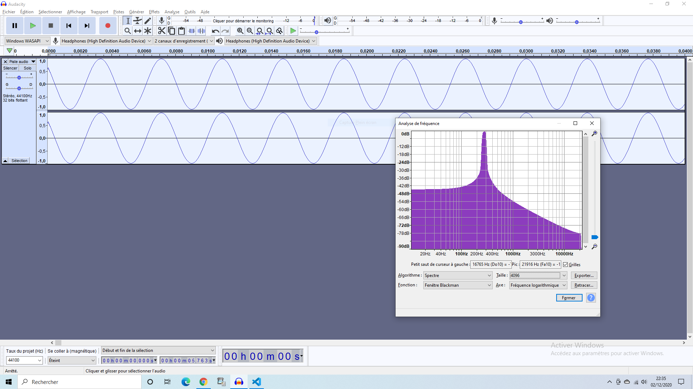

# Mouzic

## Informations Pratiques


[Sur twitch](https://www.twitch.tv/cepcam), on essaie avec l'aide de quelques Viewers de synthétiser des sons avec du code !

Merci à MarcelPatulacci, j_l_22, bebertiii et tout/es les autres pour leur aide !

Vous pouvez retrouver : 
- la vidéo sur [ma chaîne youtube](https://www.youtube.com/channel/UCp2Xw1T7tJjZmkn9oseb5RA)
- Le code, en libre accès, [sur github](https://github.com/zarnold/mouzic). Vosu pouvez même faire des pull Request et proposez vos modifs si vous le souhaitez ( et savez comment faire évidemment )
- [l'application elle même](https://zarnold.github.io/mouzic/), enfin du moins dans l'état où on l'a laissé à la fin du stream 
- et dans ce document, que vous êtes en train de lire et pouvez retrouver [ici](https://github.com/zarnold/mouzic/blob/main/README.md) quelques prises de notes théoriques ou remarques importantes faites pendant le stream !

Retrouvezplus d'infos sur [mon twitter](https://twitter.com/cepcam)
##  Faire des notes

Pour commencer , on a déjà juste essayé de jouer des sons "purs" à une fréquence donnée et il a fallut se demander quelle était la fréquence d'une note appelée "C" ou Do déjà.

Il semblerait que la règle en vigueur chez nous, en occident,soit :

- on divise un octave en 12 demis ton
- le mi et le si n'ont pas de "#" 
- du début à la fin d'une octave, on double de fréquence
- la fréquence de base, fondamentales, c'est le LA (A) à 440Hz pour des raisons arbitaires.

Avec ces 4 règles on peut construire l'ensemble de la gamme Tempérée à 12 tons avec du code !


### Application 

Pour doubler de fréquence en 12 notes, ca veut dire que d'une note à la suivante on multiplie par 1.059 car :


C'est le principe "[d'égale tempérament](https://en.wikipedia.org/wiki/Equal_temperament#:~:text=In%20modern%20times%2C%2012%2DTET,not%20always%20been%20440%20Hz.)" ( apparemment. je l'apprend en meme temps que vous )

Du coup en terme de code ca donne ca :

```javascript

const tunesName = [
  "A",
  "A#",
  "B",
  "C",
  "C#",
  "D",
  "D#",
  "E",
  "F",
  "F#",
  "G",
  "G#",
];

const A_STANDARD_PITCH = 440

const tuneValues = tunesName.map((note, idx) => ({
  name: note,
  freq: A_STANDARD_PITCH * 1.05946 ** idx,
}));
``` 

qui nous fait :

```json
[
    {"name":"A","freq":440},
    {"name":"A#","freq":466.16240000000005},
    {"name":"B","freq":493.8804163040001},
    {"name":"C","freq":523.2465458574359},
    {"name":"C#","freq":554.3587854741191},
    {"name":"D","freq":587.3209588584102},
    {"name":"D#","freq":622.2430630721313},
    {"name":"E","freq":659.2416356024004},
    {"name":"F","freq":698.4401432553191},
    {"name":"F#","freq":739.9693941732804},
    {"name":"G","freq":783.9679743508237},
    {"name":"G#","freq":830.5827101057238}
]
```

Ce qui ne nous  amène pas trop loin du G#5 théorique à 830.61Hz [d'apres cette page.](https://pages.mtu.edu/~suits/notefreqs.html).

Vous pouvez écouter le résultat [ici](https://zarnold.github.io/mouzic/) 

## Harmoniques

On peut constater en écoutant les notes que ca ne ressemble pas du tout à un instrument de musique réel et ça, apparemment serait du à une histoire d'harmonique.


Voici la forme d'onde d'un  DO ( C ) observé avec Audacity et sa "transformée de Fourier" ( son spectre fréquentiel )



Juste avant que le logiciel de Streaming ne plante !

Heureusement il existe dans l'API Web Audio une fonction "customWave" qui permet de définir ses propres formes d'ondes en décrivant les harmoniques, ce que nous essaieront de faire une prochaine fois...